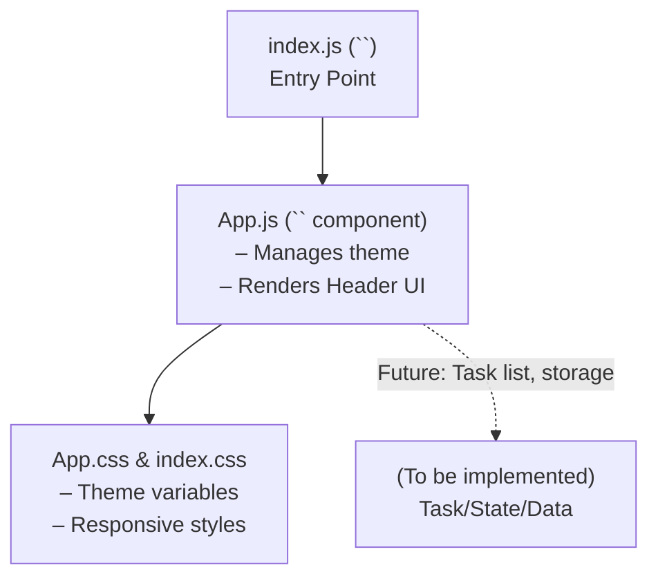

# ToDoListAppMonolith Architecture

## Overview

The ToDoListAppMonolith project is currently structured as a lightweight, single-page React application. The design is intended for a future to-do list manager but, as of this state, only implements theme switching between light and dark modes. No task management, local storage, or backend/API integration is present yet.

### Project Scope

- **Type:** React monolith (single deployment unit)
- **Current function:** Theme toggle and placeholder UI
- **Target function:** To-do list management with add/edit/delete, local storage or embedded database, user customization, responsive design, and accessibility

## Application Structure

The application entry point and major files:
- `src/index.js` – Entry point; renders the main `<App />` component in the HTML root.
- `src/App.js` – Main React component at present; manages the theme (light/dark) and renders a header with a logo, theme switch, and link to React documentation.
- `src/App.css` – CSS styling file: defines theme variables (light/dark), responsive styles, and base classes.
- `src/index.css` – Global font and code display styling.

## Current Component Flow

All application logic lives inside `App.js`. The App component uses React hooks to manage UI state (the theme) and applies this state to the document root for CSS variable swapping. There are no props, context, child components, or external storage. 

### Main elements in App.js

- **useState:** Tracks the current theme (`light` or `dark`).
- **useEffect:** Applies the theme as a `data-theme` attribute on the root element for CSS styling.
- **toggleTheme:** Switches between light and dark mode.

## Component Diagram

- Dashed edge indicates intended/planned extension.

## Design and Theming

- Theme is controlled with CSS variables defined in `App.css` under `:root` and `[data-theme="dark"]`.
- The UI includes a button to toggle themes, reflects the current theme state, and basic logo/links.
- No global state management, API communication, or persistence currently exists.

## Extensibility

This architectural base is designed to be easy to extend. Future implementation stages are expected to add:
- Child components for task items and task lists
- Data persistence (via browser localStorage or embedded database)
- User input handling, validation, editing, and bulk actions
- Accessibility, notification, and settings features

## Summary

The project is a clean foundation intended for rapid expansion into a full-featured to-do list manager, currently demonstrating React setup, theme switching, and styling structure.

